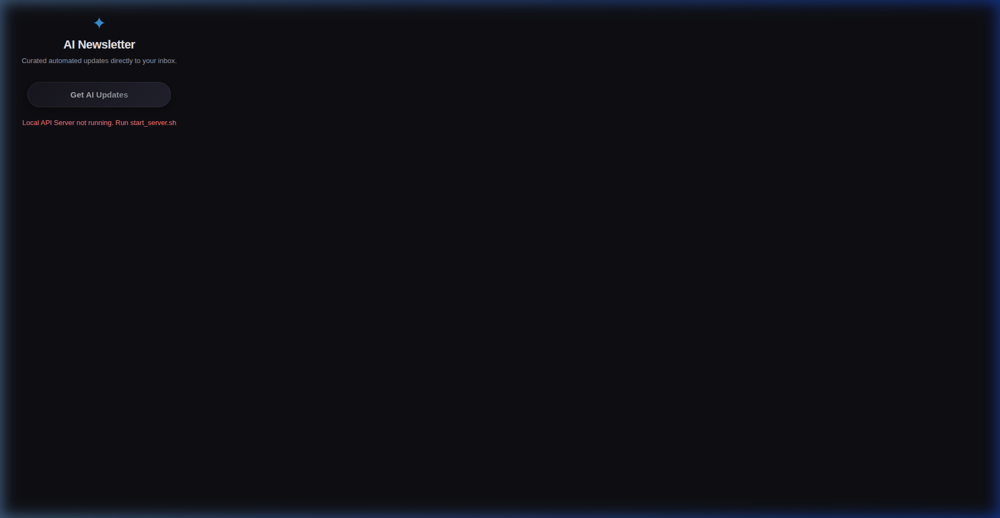
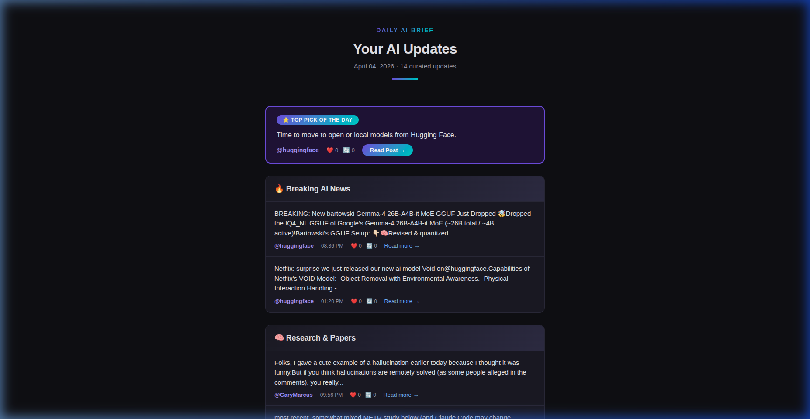

# 🤖 AI Newsletter Bot

A fully automated pipeline that fetches AI-related posts from X (Twitter), curates them into a beautiful newsletter, and delivers it to your Gmail inbox every morning.

---

## 👀 Preview

| **Chrome Extension** | **Newsletter Design** |
|:---:|:---:|
|  |  |

---

## ✨ Features

- 📡 **Multi-source fetching** — X API v2, Nitter scraping, RSS feeds
- 🧠 **Smart AI filtering** — keyword matching, relevance scoring, junk removal
- 🗂 **Auto-categorization** — Breaking News, Research, Tools, Tips, Industry
- ⭐ **Top Pick of the Day** — highlights the most important update
- 🎨 **Beautiful HTML emails** — dark mode, mobile-friendly, clean design
- 🔄 **Deduplication** — tracks history to never send the same post twice
- ⏰ **Daily scheduling** — cron or built-in scheduler with retry logic
- ⚙️ **Easy configuration** — single YAML file for everything

---

## 🚀 Installation & Setup

Follow these 4 simple steps to get the bot running on your machine:

### 1️⃣ Clone & Initialize
Run the automated setup script to install dependencies and prepare your environment:
```bash
git clone https://github.com/pawanthanay/AI-Newsletter-Automation.git
cd AI-Newsletter-Automation
chmod +x setup.sh && ./setup.sh
```

### 2️⃣ Add Your Secret Keys
The setup script creates a `config.yaml` from a template. You must fill in your own credentials:
1.  Open `config.yaml` in your code editor.
2.  **Email**: Generate a [Gmail App Password](https://myaccount.google.com/security) and add it to `app_password`.
3.  **X (Twitter) API**: (Optional) Add your `bearer_token` from [developer.x.com](https://developer.x.com).

### 3️⃣ Start the Backend Server
To use the Chrome extension, the bridge server must be running:
```bash
./start_server.sh
```
*The server runs at `http://localhost:5000`.*

### 4️⃣ Load the Chrome Extension
1.  Open Chrome and navigate to `chrome://extensions/`.
2.  Turn **ON** the "Developer mode" switch (top right).
3.  Click **Load unpacked** (top left).
4.  Select the `extension/` folder inside this project directory.
5.  **You're all set!** Click the AI icon in your browser to trigger a newsletter anytime.

---

## 📖 Advanced Usage

| Command | Description |
|---------|-------------|
| `python main.py --demo` | Generate a newsletter with fake data (no API needed) |
| `python main.py --preview` | Build the HTML but don't send the email |
| `python main.py --schedule` | Run the auto-scheduler (stays active) |
| `./setup_cron.sh` | Install as a background system task (recommended) |

---

## 📖 Usage

| Command | Description |
|---------|-------------|
| `python main.py` | Run pipeline once and send email |
| `python main.py --demo` | Generate newsletter with sample data |
| `python main.py --preview` | Generate HTML preview only |
| `python main.py --schedule` | Start daily auto-scheduler |
| `python main.py --test-email` | Send a test email |
| `python main.py --verbose` | Enable debug logging |
| `python main.py --config path/to/config.yaml` | Use custom config |

---

## ⏰ Cron Setup (Recommended)

For the most reliable daily automation:

```bash
chmod +x setup_cron.sh && ./setup_cron.sh
```

This automatically:
- Converts your IST time to UTC
- Installs a cron job
- Saves logs to `logs/cron.log`

Or manually:

```bash
# Edit crontab
crontab -e

# Add (example: 8:00 AM IST = 02:30 UTC)
30 2 * * * cd /path/to/project1 && ./venv/bin/python main.py >> logs/cron.log 2>&1
```

---

## 📁 Project Structure

```
project1/
├── main.py              # Entry point with CLI
├── config.yaml          # All configuration
├── requirements.txt     # Python dependencies
├── setup.sh             # Auto-setup script
├── setup_cron.sh        # Cron installation
├── README.md
├── src/
│   ├── __init__.py
│   ├── config_loader.py # Configuration management
│   ├── fetcher.py       # X post fetching (API/scraping/RSS)
│   ├── filter.py        # AI content filtering & scoring
│   ├── newsletter.py    # Newsletter generation
│   ├── template_builder.py  # Inline HTML builder
│   ├── emailer.py       # Gmail SMTP sender
│   ├── scheduler.py     # Daily scheduling with retry
│   └── demo_data.py     # Sample data for testing
├── templates/
│   └── newsletter.html  # Jinja2 email template
├── history/             # Deduplication tracking
└── logs/                # Application logs
```

---

## 🛠 X (Twitter) Data Sources

The bot tries multiple methods in order:

| Priority | Method | Requirements |
|----------|--------|-------------|
| 1 | **X API v2** | Bearer token (apply at [developer.x.com](https://developer.x.com)) |
| 2 | **Nitter** | No credentials needed |
| 3 | **RSS bridges** | No credentials needed |

For best results, add your X API bearer token to `config.yaml`:

```yaml
x_api:
  bearer_token: "your_bearer_token_here"
```

---

## 📰 Newsletter Sections

| Section | Emoji | Content |
|---------|-------|---------|
| Breaking News | 🔥 | Major announcements, launches |
| Research & Papers | 🧠 | Arxiv papers, studies, benchmarks |
| Tools & Releases | 🛠 | Libraries, SDKs, open-source |
| Practical Tips | 💡 | Tutorials, guides, best practices |
| Industry Updates | 📊 | Funding, regulation, market trends |

---

## 🎨 Customization

### Add/Remove Accounts

```yaml
accounts:
  - NewAccount
  # - RemovedAccount  (comment out to disable)
```

### Change Send Time

```yaml
schedule:
  time: "07:30"          # Any 24hr format
  timezone: "Asia/Kolkata"
```

### Toggle Dark Mode

```yaml
newsletter:
  dark_mode: false   # Switch to light mode
```

### Adjust Content Volume

```yaml
newsletter:
  max_items_per_section: 8   # More items per section
```

---

## 🔧 Troubleshooting

| Issue | Solution |
|-------|----------|
| No posts fetched | Check internet; try `--demo` to verify pipeline |
| Auth error | Regenerate Gmail App Password |
| "2-Step Verification required" | Enable 2FA on Google Account first |
| Empty newsletter | Add more accounts or broaden keywords |
| Nitter blocked | Instances rotate; system auto-tries alternatives |

---

## 📄 License

MIT License — free for personal and commercial use.
